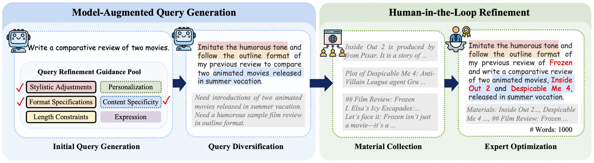
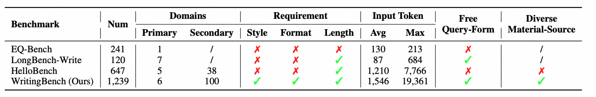
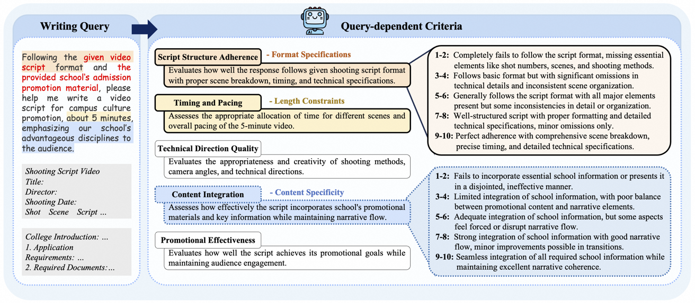
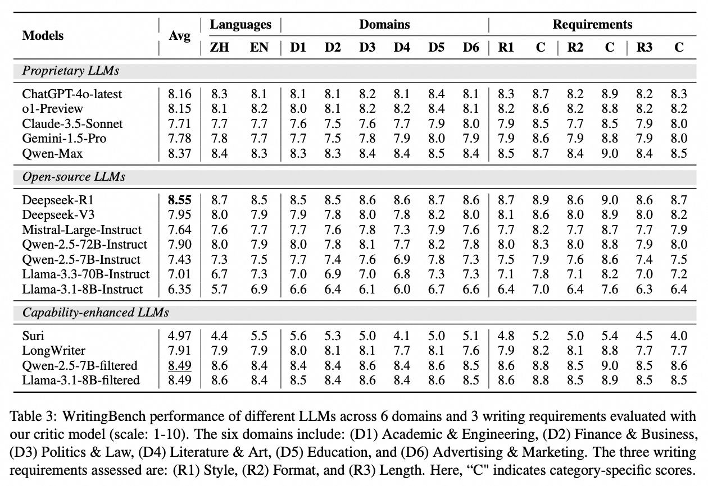

# WritingBench: A Comprehensive Benchmark for Generative Writing
<p align="center">
    📃 <a href="https://arxiv.org/abs/2503.05244" target="_blank">Paper</a>
</p>

<div align="center">
  
</div>

## 📖 Overview
WritingBench is a comprehensive benchmark for evaluating LLMs' writing capabilities across **1,239 real-world queries**, spanning:
- 6 primary domains 
- 100 fine-grained subdomains
- 3 core writing requirements: Style / Format / Length
- 1,546 avg. tokens per query

WritingBench integrates diverse sources of materials, averaging 1,546 tokens per source. Each query is paired with 5 instance-specific criteria, scoring either through LLM evaluators or through a finetuned critic model.

<div align="center">
  
</div>


## 🏗️ Benchmark Construction

WritingBench is built through a hybrid pipeline combining **Model-Augmented Query Generation** and **Human-in-the-Loop Refinement**, ensuring both diversity and real-world applicability. The construction process involves two key phases:

### Model-Augmented Query Generation

#### Phase 1: Initial Query Generation
Leverage LLMs to generate queries from a two-tiered domain pool grounded in real-world writing scenarios, consisting of 6 primary domains and 100 secondary subdomains, covering:
   - 🔬 Academic & Engineering
   - 💼 Finance & Business
   - ⚖️ Politics & Law
   - 🎨 Literature & Art
   - 🎓 Education
   - 📢 Advertising & Marketing

#### Phase 2: Query Diversification
Enhance the diversity and practical applicability of queries by random selected strategies from **Query Refinement Guidance Pool**, covering:
- Style Adjustments (e.g., kid-friendly tone)
- Format Specifications (e.g., IEEE template)
- Length Constraints (e.g., 500-word summary)
- Personalization (e.g., educator's perspective)
- Content Specificity (e.g., 2023 Q3 metrics)
- Expression Optimization (query rewriting)

### Human-in-the-Loop Refinement

#### Phase 1: Material Collection
30 trained annotators collect necessary open-source materials (e.g., public financial statements or legal templates), guided by material requirements generated by LLMs.

#### Phase 2: Expert Screening & Optimization**  
5 experts conduct a delicate two-stage filtering process: 
- query adaptation: ambiguous or unrealistic queries are revised to better align with the provided materials and practical scenarios
- material pruning: redundant or irrelevant content is eliminated from the collected materials

## 📈 Evaluation Framework

### Phase 1: Dynamic Criteria Generation
Given a query $q$ in the WritingBench, the LLM is prompted to automatically generate a set of five evaluation criteria, $C_q = \{c_1, \ldots, c_5\}$. Each criterion comprises three components: a concise name summarizing the criterion, an extended description elaborating on the evaluation focus, and detailed scoring rubrics, which provide fine-grained quality levels for the respective evaluation dimensions.

### Phase 2: Rubric-based Scoring
For each criterion $c_i \in C_q$, the evaluator independently assigns a score on a 10-point scale to a response $r$, providing both a score and a justification.


<div align="center">
  
</div>


## 🛠 Installation
```bash
git clone https://github.com/yourusername/WritingBench.git
```

## 📂 Repository Structure
```bash
.
├── evaluate_benchmark.py     # Evaluation script
├── prompt.py                 # Prompt templates
├── evaluator/
│   ├── __int__.py
│   └── llm.py                # LLM evaluation interface
└── benchmark_query/
    ├── benchmark_all.jsonl   # Full dataset (1239 queries)
    └── requirement/
        ├── style/            # Style-specific subsets
        │   ├── style_subset.jsonl
        │   └── style_subset_C.jsonl
        ├── format/           # Format-specific subsets
        │   ├── format_subset.jsonl
        │   └── format_subset_C.jsonl
        └── length/           # Length-specific subsets
            ├── length_subset.jsonl
            └── length_subset_C.jsonl
```

## 🚀 Quick Start

1. Add your API credentials:
- For LLM-as-a-Judge, see evaluator/llm.py
```bash
  self.api_key = "your_api_key_here"
  self.url = "Your API endpoint"
  self.model = "Chose your model name"
```
- For critic model (coming soon)

2. Choose appropriate evaluation sets from benchmark_query/
```bash
python evaluate_benchmark.py \
  --query_criteria_file query_set.jsonl \
  --input_file samples.jsonl \
  --output_file scores.jsonl
```

## 📊 Evaluation Results

<div align="center">
  
</div>

## 📝 Citation

```
@misc{wu2025writingbench,
      title={WritingBench: A Comprehensive Benchmark for Generative Writing}, 
      author={Yuning Wu and Jiahao Mei and Ming Yan and Chenliang Li and SHaopeng Lai and Yuran Ren and Zijia Wang and Ji Zhang and Mengyue Wu and Qin Jin and Fei Huang},
      year={2025},
      url={https://arxiv.org/abs/2503.05244}, 
}
```
